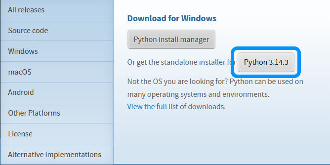
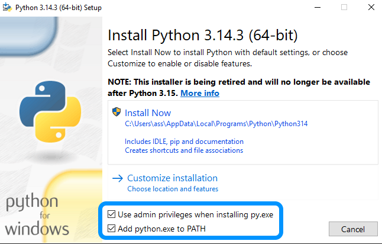
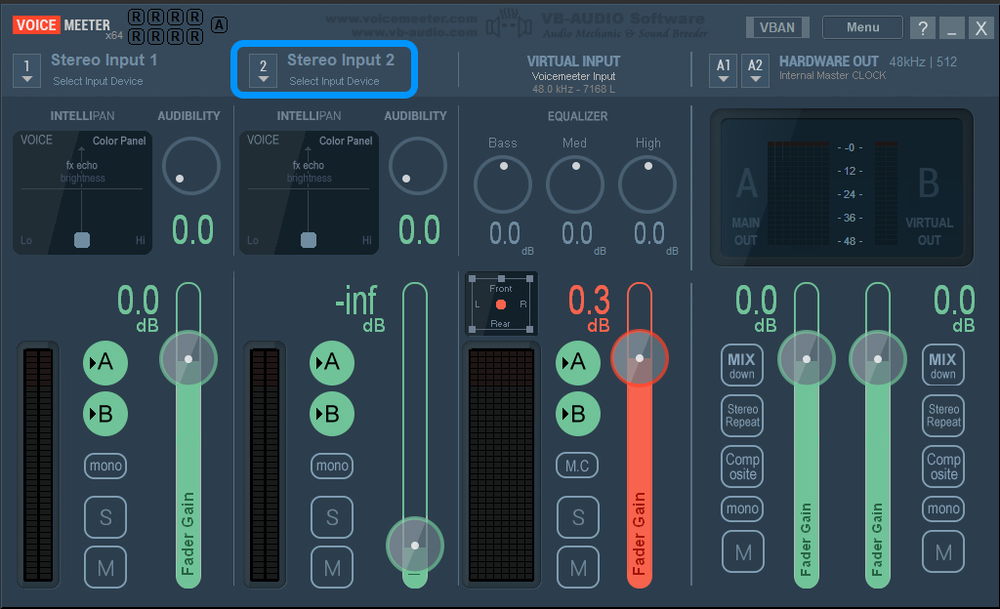
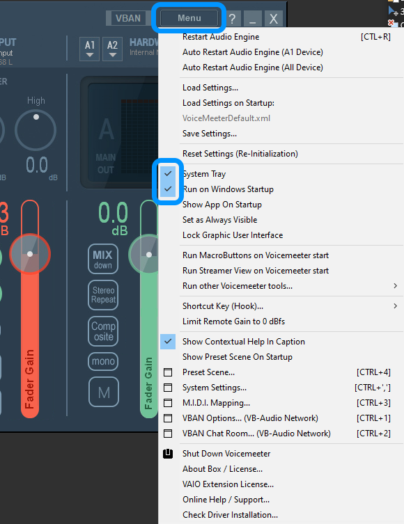

# kakishpad
### a free command line-interface Soundpad alternative
### kakish pad uses VB-AUDIO Voicemeeter to mix your primary microphone with audio output from simple python script, that plays sounds to your primary speakers and to VB-AUDIO Voicemeeter Virtual Input.
### Also it uses ffmpeg to convert user's audio files to .wav format, bc for some reason winsound can't play anything other than .wav

# **IMPORTANT**
### currently kakishpad is supported **ONLY** on Windows

# adding sounds
1. Move your desired .mp3/wav/ogg/flac files to /sounds folder
2. Run "main.py"
3. Wait for the program to convert all audio files to .wav
4. Assign keys for each sound when prompted

# using the program
### 1. for temporary disabling/enabling kakishpad, press ctrl+alt+backspace
### 2. for changing keys assigned to sounds, open "sounds.map", edit the file accordingly
### 3. for stopping current sound, press Delete
### 4. **IMPORTANT!** Only assign latin letters and your typical keyboard special characters or key combinations to sounds

# setup
### 1. Install python with PIP
1. Download python installer from [python.org](python.org).  
2. Run it as administrator 
3. **IMPORTANT!** You NEED to tick these options before clicking install, or kakishpad setup won't work. 
4. Click install.

### 2. Download and install kakishpad
1. Download the latest kakishpad release from the [releases page](https://github.com/purpurb/kakishpad/releases).
2. Untar / unzip the archive to desired folder (e.g Desktop)
3. Go into the "setup" folder
4. Double click on "setup.py"
5. Procceed with installation

### 3. Configuring VB-AUDIO Voicemeeter
1. Set Stereo Input 2 as your primary microphone 
2. Press menu
3. Tick these options 
4. Close the window if you want

### 4. Setting default mic
1. Open your system sound settings (In Windows, right click on volume icon in taskbar, "Open sound settings"/"Открыть параметры звука")
2. Set your default microphone to "Voicemeeter Out B1"
3. In other apps also do the same

# troubleshooting
## setup crashes
1. Check if you installed python correctly, you **NEED** to have PIP (Python Package Manager) for setup to work correctly 
2. Try running VB-AUDIO Voicemeeter setup separately

## program crashes
1. Check if you have ran the setup and it completed succesfully
2. Clear "sounds.map" file contents
3. Check if all files are in the app directory
4. Check for cyrillic/arabian/other non-latin characters in "sounds.map" file, if present, replace with latin letters / typical keyboard special characters
5. Check if you have VB-AUDIO Voicemeeter installed and configured correctly

## no sound in games / vc
1. Check if you set mic in according app to "Voicemeeter Out B1"
2. Check if there is any sound in "Voicemeeter Out B1" (Test it in the settings app)
3. idk
